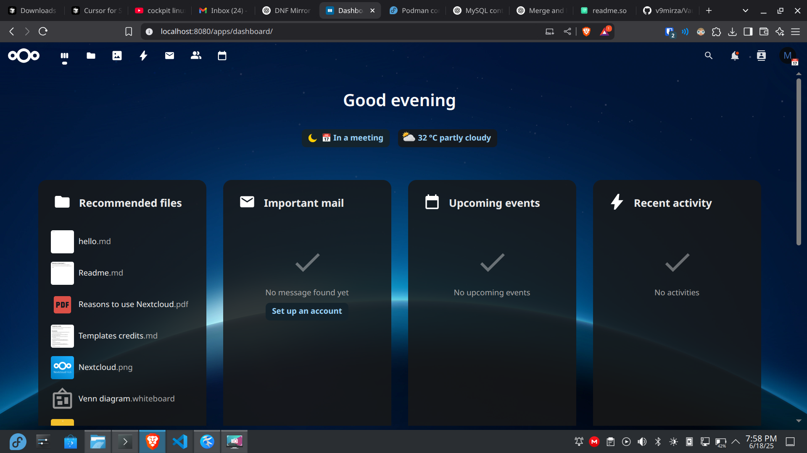

# ☁️ VaultCloud — Self-Hosted Nextcloud with Podman

A minimal, high-performance Nextcloud deployment using **Podman** or **Docker**, deployable via `podman-compose` or manual commands. Built for developers, privacy enthusiasts, and digital minimalists.

> ⚙️ Built by [v9mirza](https://v9mirza.com) — because why rent the cloud when you can *be* the cloud?

---

## 📦 Tech Stack Overview

| Component        | Purpose                            |
|------------------|------------------------------------|
| **Nextcloud**     | PHP + Apache app container         |
| **MySQL 8.4**     | Database backend                   |
| **Podman**        | Rootless container engine          |
| **podman-compose** | Easy orchestration (or Docker)    |
| **Cockpit** (opt) | GUI for managing containers        |
| **Caddy** (opt)   | HTTPS & reverse proxy              |

---

## 📁 File Structure

```plaintext
vaultcloud/
├── podman-compose.yml        # Main container orchestration file
├── README.md                 # Project documentation
├── screenshots/              # UI previews
│   └── nc1.png
```

---

## 🚀 Quick Start with `podman-compose`

```bash
git clone https://github.com/v9mirza/vaultcloud.git
cd vaultcloud
podman-compose up -d
```

Then access your cloud at: http://localhost:8080

> ✅ Works with Docker too — just replace `podman-compose` with `docker-compose`.

---

## 🧰 Manual Setup (Step-by-Step)

### 1. 🔧 Create Pod & Volumes

```bash
podman pod create --name nextcloud-pod -p 8080:80
podman volume create nextcloud-db
podman volume create nextcloud-data
```

### 2. 🛢 Deploy MySQL

```bash
podman run -d \
  --name nextcloud-db \
  --pod nextcloud-pod \
  -e MYSQL_ROOT_PASSWORD=secret \
  -e MYSQL_DATABASE=nextcloud \
  -e MYSQL_USER=nextcloud \
  -e MYSQL_PASSWORD=secret \
  -v nextcloud-db:/var/lib/mysql \
  docker.io/library/mysql:8
```

### 3. 🌐 Deploy Nextcloud

```bash
podman run -d \
  --name nextcloud-app \
  --pod nextcloud-pod \
  -e MYSQL_DATABASE=nextcloud \
  -e MYSQL_USER=nextcloud \
  -e MYSQL_PASSWORD=secret \
  -e MYSQL_HOST=127.0.0.1 \
  -v nextcloud-data:/var/www/html \
  docker.io/library/nextcloud
```

---

## 🧪 Access

http://<your-server-ip>:8080

---

## 🖥️ Optional: Cockpit Web UI

```bash
sudo dnf install cockpit cockpit-podman -y
sudo systemctl enable --now cockpit.socket
```

Access via: https://<your-server-ip>:9090

---

## 🔐 HTTPS with Caddy (Optional)

```bash
podman run -d --name caddy \
  -p 80:80 -p 443:443 \
  -v caddy-data:/data \
  -v /etc/caddy:/etc/caddy \
  docker.io/caddy \
  caddy reverse-proxy --from your.domain.com --to localhost:8080
```

---

## 🔁 Enable Autostart (Systemd)

```bash
podman generate systemd --name nextcloud-pod --files --new
sudo mv pod-nextcloud-pod.service /etc/systemd/system/
sudo systemctl daemon-reexec
sudo systemctl enable --now pod-nextcloud-pod
```

---

## 🧽 Cleanup

```bash
podman pod stop nextcloud-pod
podman pod rm -f nextcloud-pod
podman volume rm nextcloud-db nextcloud-data
```

---

## 📸 Screenshots

| Desktop                     |
|----------------------------|
|    |

---

## 👤 Maintained by 

**v9mirza**  
[🔗 Blog](https://mirzalog.hashnode.dev) | [🐦 Twitter](https://x.com/v9mirza)  
_"I write about tech strategy, AI trends, and digital tools — from a builder’s perspective."_
